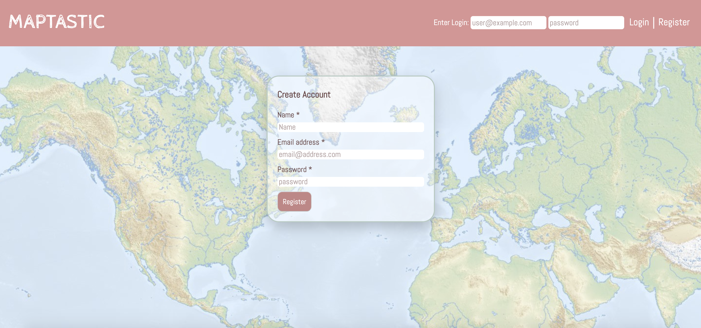
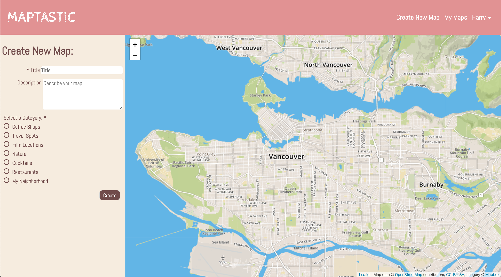
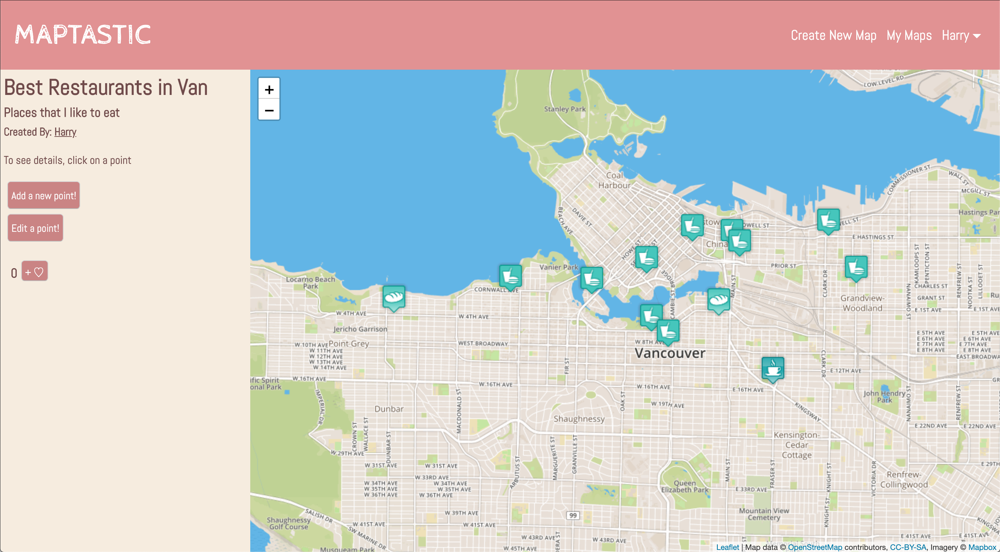
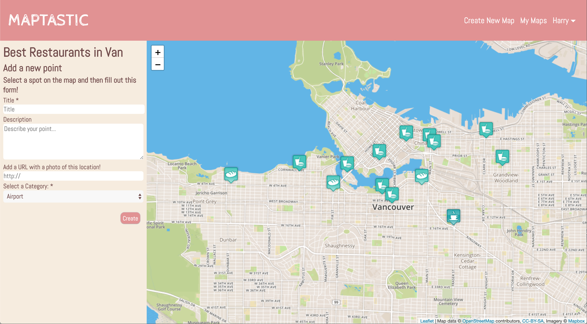
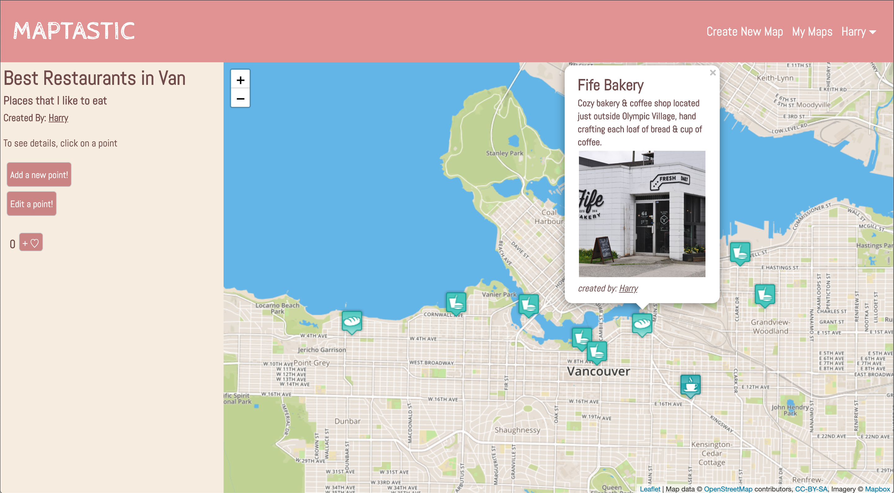
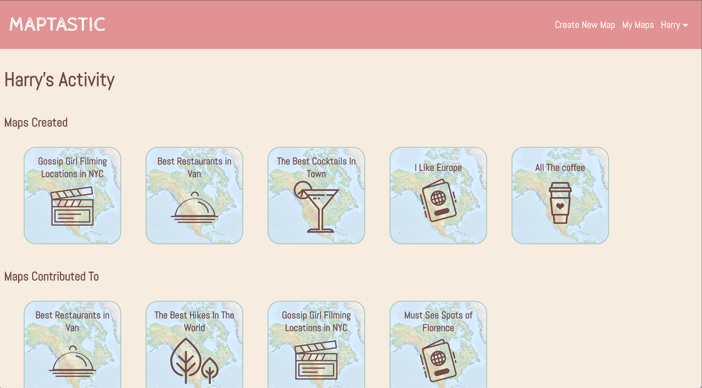

## Description

*A web app that allows users to collaboratively create maps which list multiple "points". For example: "Best Places to Eat Around Town" or "Locations of Movie Scenes".*

Maptastic is an app reminiscent of wikipedia that allows for users to create custom maps and populate them with points of their choosing. Once created, a map is visible to all users of Maptastic and can be browsed by them.

A user who is logged in to Maptastic is able to create new maps, edit and populate their maps with points as well as delete point on thier maps. Additionally, they can do the same to any map on Maptastic. A user who is logged in can also favourite maps and view the maps that they have favourited on their user page. The user page is where the maps made and contributed to can also be seen.

A user who is not logged in is able to see all of the maps that have been created and navigate and view every map. They are not able to edit, add or delete points. Nor are they able to favourite maps.

Each point has a title, image and description as well as a creator id.

---
## Screen Shots

Home Page

Register

Create New Map

Map View

New Point

Point Details

User Page

---
## Getting Started

1. Create the `.env` by using `.env.example` as a reference: `cp .env.example .env`
2. Update the .env file with your correct local information
3. Install dependencies: `npm i`
4. Reset database: `npm run db:reset`
  - Check the db folder to see what gets created and seeded in the SDB
5. Run the server: `npm run local`
  - Note: nodemon is used, so you should not have to restart your server
6. Visit `http://localhost:8080/`

---
## Tips

- Use the `npm run db:reset` command each time there is a change to the database schema or seeds. 
  - It runs through each of the files, in order, and executes them against the database. 
  - Note: you will lose all newly created (test) data each time this is run, since the schema files will tend to `DROP` the tables and recreate them.

---
## Dependencies

- Node 10.x or above
- NPM 5.x or above
- PG 6.x or above
- Bcrypt 3.x or above
- Body-parser 1.x or above
- Chalk 2.x or above
- Cookie-session 1.x or above
- Dotenv 2.x or above
- ejs 2.x or above
- Express 4.x or above
- Morgan 1.x or above
- Node-sass-middleware 0.11.x or above
- pg-native 3.x or above
- Nodemon 1.19.x or above
